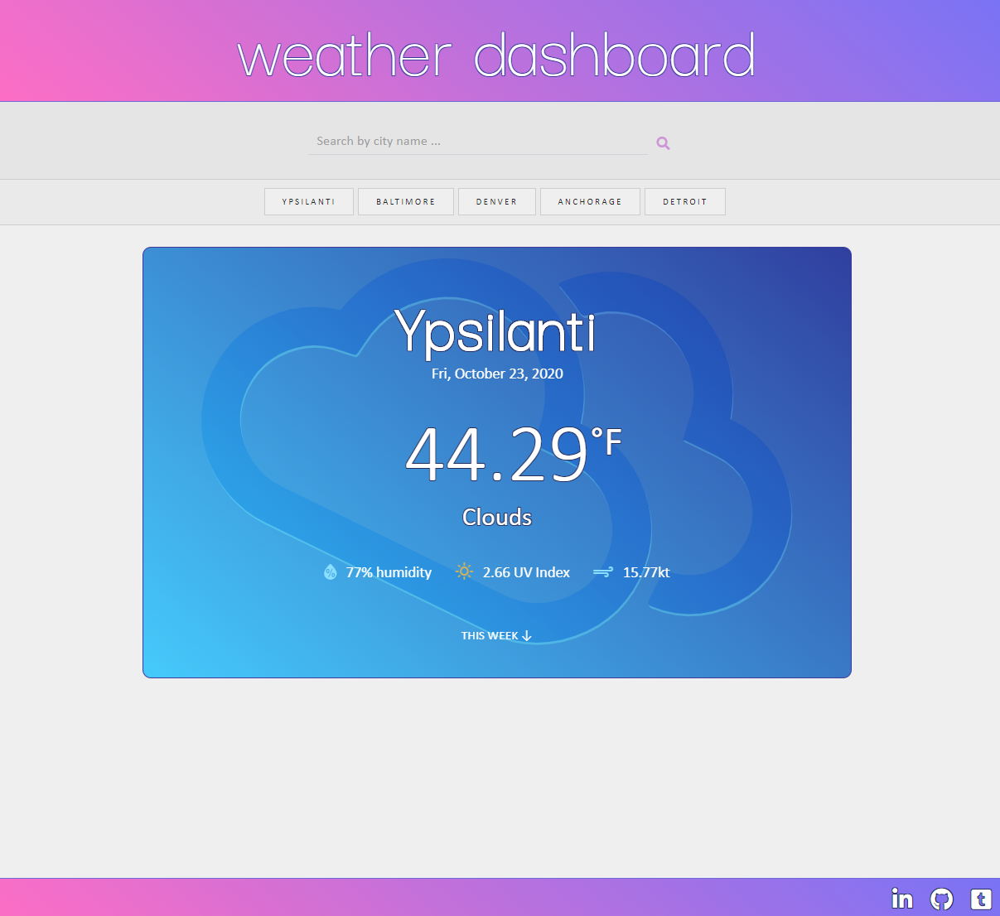
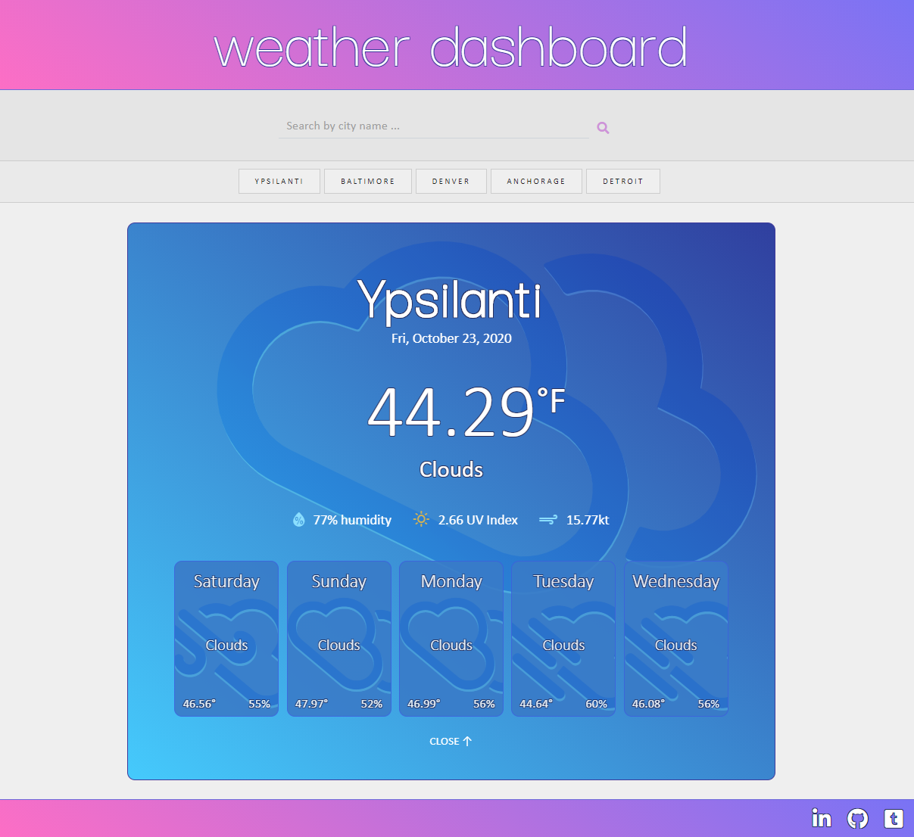

# weather dashboard

[Link to Working Application](https://nova-codes.github.io/weather-dashboard)

### Overview
The goal of this website/app was to create a fully-functional weather dashboard utilizing two different OpenWeather APIs (one for current weather/forecast and another for the UV index). Upon visiting the site for the first time, all the fields will be blank and the only thing you're able to do is search for a city.

Once the user enters the name of a valid city and submits (using the enter key or clicking the magnifying glass) the weather data for that city will be shown, along with a 5 day forecast. Each day of the forecast will show the day of the week, the weather description, a weather icon relating to that description, the temperature, and the humidity.

The previous five cities searched for will be displayed beneath the search input. Clicking on these previous search results will once again display the weather for the selected city.